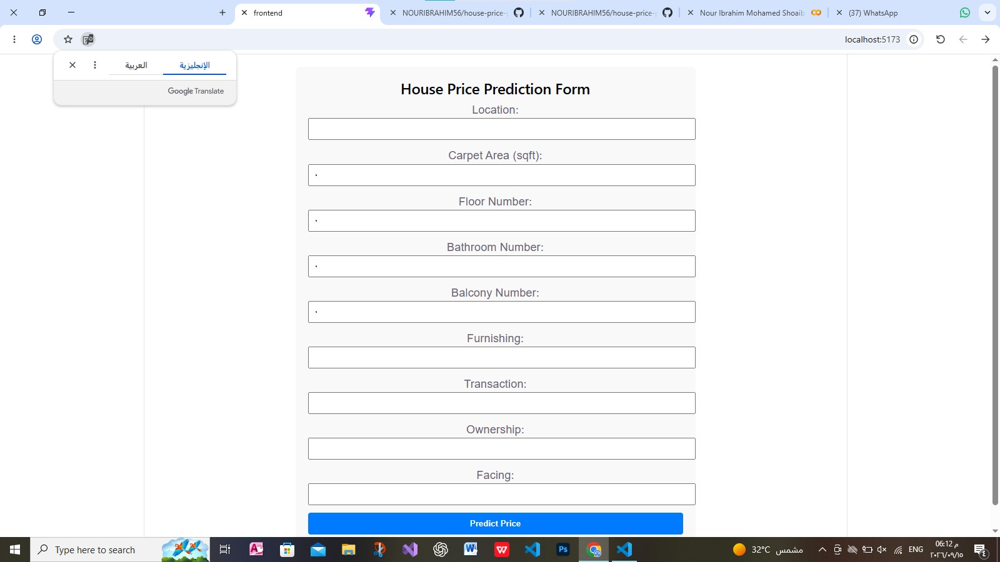

# House Price Prediction (End-to-End ML Web App)

An end-to-end machine learning project that predicts house prices in India based on property features. The project includes a trained ML model, a FastAPI backend, and a React frontend.

---

## Table of Contents

- [Overview](#overview)
- [Tech Stack](#tech-stack)
- [Project Structure](#project-structure)
- [Dataset](#dataset)
- [Setup Instructions](#setup-instructions)
- [API Reference](#api-reference)
- [Model Metrics](#model-metrics)
- [Screenshots](#screenshots)

---

## Overview

This project builds a complete machine learning product that:
- Cleans and processes messy real estate data from India
- Trains multiple regression models and compares them
- Serves the best model through a FastAPI backend
- Provides an interactive React frontend for predictions

---

## Tech Stack

| Layer | Technology |
|---|---|
| Data Processing | Python, Pandas, NumPy |
| Machine Learning | Scikit-learn (RandomForestRegressor) |
| Backend | FastAPI, Uvicorn, Pydantic |
| Frontend | React, TypeScript, Vite |
| Version Control | Git, GitHub |
# House Price Prediction (End-to-End ML Web App)

An end-to-end machine learning project that predicts house prices in India based on property features. The project includes a trained ML model, a FastAPI backend, and a React frontend.

---

## Table of Contents

- [Overview](#overview)
- [Tech Stack](#tech-stack)
- [Project Structure](#project-structure)
- [Dataset](#dataset)
- [Setup Instructions](#setup-instructions)
- [API Reference](#api-reference)
- [Model Metrics](#model-metrics)
- [Screenshots](#screenshots)

---

## Overview

This project builds a complete machine learning product that:
- Cleans and processes messy real estate data from India
- Trains multiple regression models and compares them
- Serves the best model through a FastAPI backend
- Provides an interactive React frontend for predictions

---

## Tech Stack

| Layer | Technology |
|---|---|
| Data Processing | Python, Pandas, NumPy |
| Machine Learning | Scikit-learn (RandomForestRegressor) |
| Backend | FastAPI, Uvicorn, Pydantic |
| Frontend | React, TypeScript, Vite |
| Version Control | Git, GitHub |

---

## Project Structure
```markdown

```

house-price-prediction/
├── app/                      # FastAPI Backend
│   ├── main.py               # Application entry point
│   ├── schemas/              # Pydantic request/response models
│   ├── services/             # Model loading and preprocessing
│   └── api/routes/           # API endpoints
├── frontend/                 # React Frontend
│   ├── src/
│   │   ├── components/       # Reusable UI components
│   │   ├── types/            # TypeScript type definitions
│   │   ├── api.ts            # API client
│   │   └── App.tsx           # Main application
│   └── package.json
├── models/
│   └── house_price.pkl       # Trained model
├── notebooks/
│   └── house_price_model.ipynb  # Data cleaning, EDA, training
├── requirements.txt          # Python dependencies
├── locations.json            # List of allowed locations
└── README.md

```

---

## Dataset

**Source:** [House Price by Juhi Bhojani](https://www.kaggle.com/datasets/juhibhojani/house-price)

- **Size:** 187,531 rows, 21 columns
- **Content:** Real property listings from India
- **Target:** `Amount (in rupees)` - converted to numeric price

### Download Instructions

1. Create a free account at [kaggle.com](https://www.kaggle.com)
2. Go to Settings > API > Create New Token
3. Download `kaggle.json` and place it in `~/.kaggle/`
4. Run:
```bash
kaggle datasets download -d juhibhojani/house-price
unzip house-price.zip
```

Note: The raw CSV file is not committed to this repository due to its size.

---

Setup Instructions

Prerequisites

· Python 3.11+
· Node.js 18+
· Git

Backend Setup

```bash
cd app
pip install -r requirements.txt
python -m uvicorn app.main:app --reload
```

Backend will run on: http://localhost:8000

Frontend Setup

```bash
cd frontend
npm install
npm run dev
```

Frontend will run on: http://localhost:5173

Environment Variables

Create a .env file in the frontend/ folder:

```
VITE_API_URL=http://localhost:8000
```

---

API Reference

GET /health

Check if the API is running.

Response:

```json
{"status": "ok"}
```

POST /predict

Predict the price of a house.

Request Body:

```json
{
  "location": "Mumbai",
  "carpet_area_sqft": 1200,
  "floor_num": 3,
  "bathroom": 2,
  "balcony": 1,
  "furnishing": "Semi-Furnished",
  "transaction": "Resale",
  "ownership": "Freehold",
  "facing": "East"
}
```

Response:

```json
{"predicted_price": 12500000.0}
```

---

Model Metrics

The best model is RandomForestRegressor with the following performance:

Metric Value
MAE 1,444,530
RMSE 4,206,246
R² 0.878

Model Comparison

Model MAE RMSE R²
Linear Regression 4,413,547 7,143,162 0.651
Random Forest 1,444,530 4,206,246 0.878

Conclusion: Random Forest outperformed Linear Regression because it captures non-linear relationships in the data.

---

Author

Nour Ibrahim

· GitHub: @NOURIBRAHIM56

```

---
---

## Screenshots

